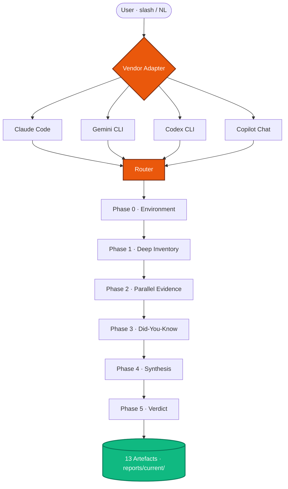

<div align="center">

# Ulak OS

### Vendor-neutral prompt operating system for AI coding CLIs

_Reads your project · surfaces gaps · scaffolds full-stack SaaS_

<br>

[](https://github.com/osrt91/ulak-os/releases)
[](./LICENSE)
[](https://github.com/osrt91/ulak-os/stargazers)

[](./docs/adapters/claude-code.md)
[](./docs/adapters/gemini-cli.md)
[](./docs/adapters/codex-cli.md)
[](./docs/adapters/copilot-chat.md)

[**🇹🇷 Türkçe**](./README.md) · **🇬🇧 English** (this file) · [**📚 Docs**](./docs/) · [**🗺️ Catalog**](./docs/catalog.md) · [**📝 Changelog**](./CHANGELOG.md)

</div>

---

<div align="center">

### ⚡ Start in 30 seconds

<table>
<tr>
<td width="33%" align="center" valign="top">

### 👋<br>New here
<br>

```
/ulak-hello
```

30-second tour<br>4 options, direct routing

</td>
<td width="33%" align="center" valign="top">

### 🔍<br>Existing project
<br>

```
/director komple
```

Phase 0→5 audit<br>27 specialists in parallel

</td>
<td width="33%" align="center" valign="top">

### 🛠️<br>New SaaS
<br>

```
/ulak-start
```

27-question wizard<br>Production-ready at commit 1

</td>
</tr>
</table>

</div>

---

## 📦 Install

```bash
# macOS / Linux (one-liner)
curl -fsSL https://raw.githubusercontent.com/osrt91/ulak-os/main/scripts/install.sh | sh

# Windows PowerShell
iwr -useb https://raw.githubusercontent.com/osrt91/ulak-os/main/scripts/install.ps1 | iex

# Manual clone
git clone https://github.com/osrt91/ulak-os.git && cd ulak-os
```

Then: open Claude Code / Gemini CLI / Codex / Copilot, type `/ulak-hello`. The menu takes it from there.

> **Checksum + alternative methods** → [docs/runbooks/install-methods.md](./docs/runbooks/install-methods.md) · **Verification** → `ulak doctor`

---

## 🧭 Architecture



**Import chain**: `CLAUDE.md` → `@prompts/core/ulak-os-core-contract-2.0.0.md` → **26 runtime rules + 19 governance + 4 vendor adapters**. All layers load from one entry.

---

## 🎯 6 scenarios — what can I do?

<table>
<tr>
<td width="50%" valign="top">

**1. Start a new SaaS** · `5-10 min`
```bash
/ulak-start
```
27 questions, auto-dispatch → sibling dir with Next.js + Supabase + payment + i18n + CI + deploy. RLS, auth, webhook, gitleaks baseline at commit 1.

</td>
<td width="50%" valign="top">

**2. Audit an existing project** · `45-90 min`
```bash
/director komple
```
Phase 0→5: deep inventory (file+line) · 4-13 specialists parallel · did-you-know · roadmap · validation-plan · pack-gap.

</td>
</tr>
<tr>
<td width="50%" valign="top">

**3. Ask in natural language**
```bash
/ulak-ask "add turkish locale"
/ulak-ask "check for rls asymmetry"
/ulak-ask "scan pack gaps"
```
No plugin hunt, no flag memorization. Disambiguates with "did you mean?".

</td>
<td width="50%" valign="top">

**4. Discover packs + capabilities**
```bash
/ulak-packs
/pack-gap-audit
/ulak-mcp-discover
```
All 24 commands + 10 skills + 27 agents in one screen. Gap detection + MCP registry discovery.

</td>
</tr>
<tr>
<td width="50%" valign="top">

**5. Onboarding tour**
```bash
hi ulak          # EN natural greeting
selam ulak       # TR
/ulak-hello      # slash
```
30-second first screen, 4 options, direct routing.

</td>
<td width="50%" valign="top">

**6. Update + validate**
```bash
git pull origin main
ulak doctor
bash scripts/validate-*.sh
```
Cross-platform validator chain. All-green = pack healthy.

</td>
</tr>
</table>

> **Full walkthrough**: [docs/walkthrough/01-first-saas-end-to-end.md](./docs/walkthrough/01-first-saas-end-to-end.md) — 75-minute marketplace scenario (Supabase + GitHub + Vercel + Resend + Iyzico)

---

## 📊 Capability summary

<div align="center">

| **24** | **10** | **27** | **15** | **8** | **23** | **35** | **~100** |
|:---:|:---:|:---:|:---:|:---:|:---:|:---:|:---:|
| Commands | Skills | Agents | Sector packs | Rule packs | Governance | Runtime rules | Anti-patterns |

</div>

<details>
<summary><b>📂 Detailed breakdown</b></summary>

<br>

| Surface | Count | Reference |
|---|---|---|
| **Commands** | 24 | [`.claude/commands/`](./.claude/commands/) — `/director`, `/ulak-start`, `/ulak-hello`, `/ulak-scaffold`, `/ulak-ask`, `/final-verdict`, `/intake`, `/frontend-war-room`, `/pack-gap-audit`, `/triage-build`, `/ulak-design-ref`, `/ulak-audit-deep`, `/ulak-pattern-extract`, `/ulak-mcp-discover`, `/ulak-brainstorm`, `/ulak-subagent-dispatch`, `/ulak-test-driven`, `/ulak-packs`, `/ulak-search`, `/ulak-locale`, `/ulak-intake`, `/ulak-demo`, `/ulak-explain`, `/ulak-next-steps` |
| **Skills** | 10 | [`.claude/skills/`](./.claude/skills/) — `saas-scaffolder`, `fourteen-dimension-audit`, `god-module-decomposition`, `multi-agent-orchestration`, `final-validation`, `pack-gap-completion`, `project-intake`, `research-currency`, `awesome-packs-index`, `mcp-governance-auto` |
| **Agents** | 27 | [`.claude/agents/`](./.claude/agents/) — 19 specialists + 1 autonomous-program-director + 7 persona (admin, customer, bayi, developer, support, compliance, security-redteam) |
| **Sector packs** | 15 | [`templates/sectors/`](./templates/sectors/) — admin-cms-hardening, ai-copilot, ai-relay-cost-control, container-k8s, ecommerce, education, enterprise-b2b, fintech, health-sensitive, marketplace, media-content, member-gated-community, pwa-desktop, regulated-saas, self-hosted-supabase |
| **Rule packs** | 8 | [`docs/runtime/rule-packs/`](./docs/runtime/rule-packs/) — typescript-nextjs, python-fastapi, docker-compose, api-security, turkish-locale, localization-ssot, llm-streaming-context-aware, react-native-expo |
| **Governance** | 23 | [`docs/governance/`](./docs/governance/) — product-surface-split, rule-pack-governance, secrets-rotation-policy, observability-baseline, pattern-import-ledger, settings-permissions-governance, lock-file-hygiene, ai-provider-allowlist, mcp-governance, memory-hygiene, prompt-supply-chain, artefact-write-authorization, etc. |
| **Runtime** | 35 | [`docs/runtime/`](./docs/runtime/) — router, intent-router, program-phases (Phase 0-5), artefact-contract, context-budget, output-profiles, active-variable-contract, waves-pattern, live-probe-contract, dual-path-validation, persona-dispatch-pattern, runtime-constants, etc. |
| **Anti-patterns** | ~100 | 19 AP-NN (AP-01..AP-19) + classic (IDOR, BOLA, N+1, RLS asymmetry, dead code, etc.) |
| **Scaffolder** | 125 | [`templates/saas-starter/`](./templates/saas-starter/) — Next.js 16 + TS strict + Tailwind v4 + Supabase SSR + RLS + CI + tests + VPS hardening + 59-brand design reference |

</details>

---

## 🎛️ Does three things

| | Command | Produces |
|---|---|---|
| 🔍 **Audit** | `/director komple` | Phase 0→5 protocol: 27 specialists parallel, 15-dim scorecard, ~100 anti-pattern scan, 13 artefacts |
| ⚙️ **Govern** | `@prompts/core/ulak-os-core-contract-2.0.0.md` | Import core contract into CLAUDE.md → 23 governance + 15 sector + 8 rule packs active per session |
| 🏗️ **Scaffold** | `/ulak-scaffold` or `/ulak-start` | Full-stack SaaS at commit 1 — 125 template files + 8 anti-patterns gated construction-time |

---

## 🌐 Vendor support

<div align="center">

| Vendor | Command dispatch | Status | Adapter |
|:---|:---:|:---:|:---:|
| **Claude Code** | 24 slash native | ✅ FULL | [↗](./docs/adapters/claude-code.md) |
| **Gemini CLI** | 24 `.toml` native | ✅ FULL-MINUS | [↗](./docs/adapters/gemini-cli.md) |
| **Codex CLI** | 24 NL trigger | ✅ CORE | [↗](./docs/adapters/codex-cli.md) |
| **Copilot Chat** | 22 NL trigger | ⚠️ LIMITED | [↗](./docs/adapters/copilot-chat.md) |

</div>

> Disk-truth parity validation: `bash scripts/validate-vendor-parity.sh`  
> Capability matrix: [`docs/governance/vendor-capability-matrix.md`](./docs/governance/vendor-capability-matrix.md)

---

## 🛠️ Supported stacks (`/ulak-scaffold`)

| Layer | Primary | Experimental |
|---|---|---|
| Frontend | Next.js 16 | Remix, SvelteKit |
| Backend | Supabase SSR | FastAPI + Node hybrid |
| Payment | Stripe · Iyzico · both · none | — |
| Mobile | Expo 55+ (optional) | — |
| Hosting | Self-managed VPS + Traefik | Vercel · Fly.io · Railway |
| i18n | TR + EN baseline | localization-ssot pack for ≥2 locales |

---

## 📜 Release history

<table>
<tr><td><b>🚀 v1.6.0-final</b></td><td>2026-04-21</td><td>Cross-vendor parity — Gemini 7→24 native · Codex NL · Copilot NL · capability matrix · user manual refresh</td></tr>
<tr><td><b>🚶 v1.5.0</b></td><td>2026-04-21</td><td>Walkthrough #1 (75min marketplace) · "selam ulak" / "hi ulak" natural greeting</td></tr>
<tr><td><b>🧑‍🏫 v1.4.0</b></td><td>2026-04-21</td><td>External service tutorials — Supabase · Vercel · GitHub · Resend step-by-step TR</td></tr>
<tr><td><b>🎓 v1.3.0</b></td><td>2026-04-21</td><td>Beginner layer — visibility · post-scaffold onboarding · dual-mode wizard · term explainer · demo tour</td></tr>
<tr><td><b>🧙 v1.2.0</b></td><td>2026-04-21</td><td>Wizard deepening — 6q → 27q × 5 phases · auto-dispatch · catalog sync · 15-command description_en</td></tr>
<tr><td><b>👁️ v1.1.0</b></td><td>2026-04-21</td><td>Vision layer — ulak-ask · ulak-packs · ulak-search · ulak-start · ulak-hello · ulak-locale</td></tr>
<tr><td><b>🎉 v1.0.0</b></td><td>2026-04-21</td><td>Public launch — manifest reset · release notes · CLI alias · doc polish</td></tr>
</table>

Full notes: [CHANGELOG.md](./CHANGELOG.md) · [docs/release/](./docs/release/)

---

## 📚 Further reading

<table>
<tr>
<td width="50%" valign="top">

**🎬 Getting started**
- [30-sec tour](./docs/walkthrough/01-first-saas-end-to-end.md) — first SaaS walkthrough
- [First hour](./docs/runbooks/first-hour-with-ulak-os.md) — 60-min end-to-end
- [FAQ](./docs/FAQ.md) — vs alternatives · platform · offline · model
- [Troubleshooting](./docs/runbooks/troubleshooting.md) — 16 common errors

</td>
<td width="50%" valign="top">

**🧰 Reference**
- [Catalog](./docs/catalog.md) — all capabilities in one place
- [Architecture](./docs/architecture/) — 4 mermaid diagrams + prose
- [ADR](./docs/adr/) — 6 governance decisions
- [Showcase](./docs/showcase/) — 4 walkthroughs + video script

</td>
</tr>
</table>

---

## 🤝 Contribute

**No need to email — fork, run, open a PR.** Ulak OS grows through community contribution.

### ⚡ Your first contribution in 3 minutes

```bash
gh repo fork osrt91/ulak-os --clone              # 1) fork + clone
cd ulak-os && bash scripts/validate-imports.sh   # 2) see pack health
#    (add a sector pack / fix a typo / catch an anti-pattern)
gh pr create                                     # 3) open PR, template guides you
```

### 🎯 Where do I start?

| I want to | Go to |
|---|---|
| Pick a small task | [`good first issue`](https://github.com/osrt91/ulak-os/issues?q=is%3Aissue+is%3Aopen+label%3A%22good+first+issue%22) labelled open issues |
| Propose a sector pack / anti-pattern / rule pack | [pattern_contribution template](https://github.com/osrt91/ulak-os/issues/new?template=pattern_contribution.md) |
| Report a bug | [bug_report template](https://github.com/osrt91/ulak-os/issues/new?template=bug_report.md) |
| Suggest a new command / skill / agent | [feature_request template](https://github.com/osrt91/ulak-os/issues/new?template=feature_request.md) |
| Ask something without opening an issue | [Discussions](https://github.com/osrt91/ulak-os/discussions) → Q&A |
| Deep guide | [CONTRIBUTING.md](./CONTRIBUTING.md) — pack governance, evidence rules, PR checklist |

### 📞 Contact

- **Questions / ideas / general chat** → [GitHub Discussions](https://github.com/osrt91/ulak-os/discussions) (faster than email)
- **Bug reports** → [Issues](https://github.com/osrt91/ulak-os/issues/new/choose)
- **🔒 Security vulnerability** → DO NOT open an issue, mail directly: `info@oguzhansert.dev` ([SECURITY.md](./SECURITY.md))
- [Code of Conduct](./CODE_OF_CONDUCT.md) — community standard

---

<div align="center">

**📄 License** — [MIT](./LICENSE) · fork, adapt, apply to your own operation. Attribution suffices.

**👤 Maintainer** — [**Oğuzhan Sert**](https://github.com/osrt91) · `info@oguzhansert.dev`

<br>

<sub>Authoritative as of Ulak OS <b>v1.6.1</b> · Build metadata: <a href="./prompts/pack.json"><code>prompts/pack.json</code></a> · Core contract: <a href="./prompts/core/ulak-os-core-contract-2.0.0.md"><code>ulak-os-core-contract-2.0.0.md</code></a></sub>

</div>
