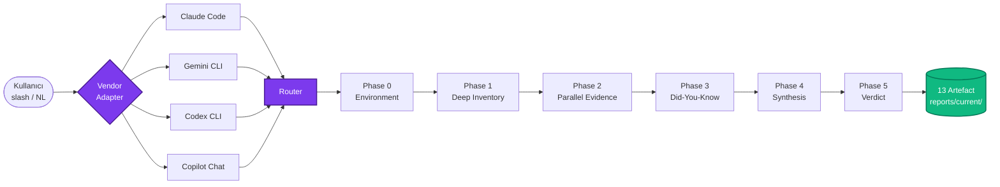

<div align="center">

# Ulak OS

### AI coding CLI'ları için vendor-agnostic prompt işletim sistemi

_Projeni okur · eksikleri söyler · tam yığın SaaS üretir_

<br>

[](https://github.com/osrt91/ulak-os/releases)
[](./LICENSE)
[](https://github.com/osrt91/ulak-os/stargazers)

[](./docs/adapters/claude-code.md)
[](./docs/adapters/gemini-cli.md)
[](./docs/adapters/codex-cli.md)
[](./docs/adapters/copilot-chat.md)

**🇹🇷 Türkçe** (bu dosya) · [**🇬🇧 English**](./README.en.md) · [**📚 Docs**](./docs/) · [**🗺️ Catalog**](./docs/catalog.md) · [**📝 Changelog**](./CHANGELOG.md)

</div>

---

<div align="center">

### ⚡ 30 saniyede başla

<table>
<tr>
<td width="33%" align="center" valign="top">

### 👋<br>Yeni kullanıcı
<br>

```
/ulak-hello
```

30 saniye tour<br>4 seçenek, direkt yönlendirme

</td>
<td width="33%" align="center" valign="top">

### 🔍<br>Var olan proje
<br>

```
/director komple
```

Phase 0→5 audit<br>27 specialist paralel

</td>
<td width="33%" align="center" valign="top">

### 🛠️<br>Yeni SaaS
<br>

```
/ulak-start
```

27-soru wizard<br>Commit 1'de production-ready

</td>
</tr>
</table>

</div>

---

## 📦 Kurulum

```bash
# macOS / Linux (tek satır)
curl -fsSL https://raw.githubusercontent.com/osrt91/ulak-os/main/scripts/install.sh | sh

# Windows PowerShell
iwr -useb https://raw.githubusercontent.com/osrt91/ulak-os/main/scripts/install.ps1 | iex

# Manuel klon
git clone https://github.com/osrt91/ulak-os.git && cd ulak-os
```

Sonra: Claude Code / Gemini CLI / Codex / Copilot aç, `/ulak-hello` yaz. Gerisi menüden.

> **Checksum + alternatif yollar** → [docs/runbooks/install-methods.md](./docs/runbooks/install-methods.md) · **Doğrulama** → `ulak doctor`

---

## 🧭 Mimari



**Imports zinciri**: `CLAUDE.md` → `@prompts/core/ulak-os-core-contract-2.0.0.md` → 33 runtime rule + 22 governance + 3 vendor adapter. Tek dosyadan tüm katmanlar yüklenir.

---

## 🎯 6 senaryo — ne yapabilirim?

<table>
<tr>
<td width="50%" valign="top">

**1. Yeni SaaS başlat** · `5-10 dk`
```bash
/ulak-start
```
27 soru, auto-dispatch → sibling dizinde Next.js + Supabase + payment + i18n + CI + deploy. Commit 1'de RLS, auth, webhook, gitleaks baseline.

</td>
<td width="50%" valign="top">

**2. Mevcut projeyi audit et** · `45-90 dk`
```bash
/director komple
```
Phase 0→5: deep inventory (dosya+satır) · 4-13 specialist paralel · did-you-know · roadmap · validation-plan · pack-gap.

</td>
</tr>
<tr>
<td width="50%" valign="top">

**3. Doğal dille sor**
```bash
/ulak-ask "turkish locale ekle"
/ulak-ask "rls asimetrisi var mı"
/ulak-ask "pack-gap tara"
```
Plugin aramadan, flag ezberlemeden. Belirsizse "bunu mu dedin?" doğrular.

</td>
<td width="50%" valign="top">

**4. Paket + kapasite ara**
```bash
/ulak-packs
/pack-gap-audit
/ulak-mcp-discover
```
Tüm 24 komut + 10 skill + 27 agent tek ekranda. Eksik tespiti + MCP registry keşfi.

</td>
</tr>
<tr>
<td width="50%" valign="top">

**5. Onboarding tour**
```bash
selam ulak       # TR natural greeting
hi ulak          # EN
/ulak-hello      # slash
```
30 saniyede ilk ekran, 4 seçenek, direkt yönlendirme.

</td>
<td width="50%" valign="top">

**6. Güncelle + doğrula**
```bash
git pull origin main
ulak doctor
bash scripts/validate-*.sh
```
Cross-platform validator zinciri. Hepsi yeşilse pack sağlıklı.

</td>
</tr>
</table>

> **Tam yol**: [docs/walkthrough/01-first-saas-end-to-end.md](./docs/walkthrough/01-first-saas-end-to-end.md) — 75 dakikalık marketplace senaryosu (Supabase + GitHub + Vercel + Resend + Iyzico)

---

## 📊 Kapasite özeti

<div align="center">

| **24** | **10** | **27** | **14** | **8** | **22** | **33** | **~100** |
|:---:|:---:|:---:|:---:|:---:|:---:|:---:|:---:|
| Komut | Skill | Agent | Sector pack | Rule pack | Governance | Runtime rule | Anti-pattern |

</div>

<details>
<summary><b>📂 Detaylı breakdown tablosu</b></summary>

<br>

| Yüzey | Sayı | Referans |
|---|---|---|
| **Komutlar** | 24 | [`.claude/commands/`](./.claude/commands/) — `/director`, `/ulak-start`, `/ulak-hello`, `/ulak-scaffold`, `/ulak-ask`, `/final-verdict`, `/intake`, `/frontend-war-room`, `/pack-gap-audit`, `/triage-build`, `/ulak-design-ref`, `/ulak-audit-deep`, `/ulak-pattern-extract`, `/ulak-mcp-discover`, `/ulak-brainstorm`, `/ulak-subagent-dispatch`, `/ulak-test-driven`, `/ulak-packs`, `/ulak-search`, `/ulak-locale`, `/ulak-intake`, `/ulak-demo`, `/ulak-explain`, `/ulak-next-steps` |
| **Skills** | 10 | [`.claude/skills/`](./.claude/skills/) — `saas-scaffolder`, `fourteen-dimension-audit`, `god-module-decomposition`, `multi-agent-orchestration`, `final-validation`, `pack-gap-completion`, `project-intake`, `research-currency`, `awesome-packs-index`, `mcp-governance-auto` |
| **Agents** | 27 | [`.claude/agents/`](./.claude/agents/) — 19 specialist + 1 autonomous-program-director + 7 persona (admin, customer, bayi, developer, support, compliance, security-redteam) |
| **Sector packs** | 14 | [`templates/sectors/`](./templates/sectors/) — education, saas, fintech, ecommerce, marketplace, enterprise-b2b, media-content, health-sensitive, ai-copilot, pwa-desktop, ai-relay-cost-control, member-gated-community, admin-cms-hardening, self-hosted-supabase |
| **Rule packs** | 8 | [`docs/runtime/rule-packs/`](./docs/runtime/rule-packs/) — typescript-nextjs, python-fastapi, docker-compose, api-security, turkish-locale, localization-ssot, llm-streaming-context-aware, react-native-expo |
| **Governance** | 22 | [`docs/governance/`](./docs/governance/) — product-surface-split, rule-pack-governance, secrets-rotation-policy, observability-baseline, pattern-import-ledger, settings-permissions-governance, lock-file-hygiene, ai-provider-allowlist, mcp-governance, memory-hygiene, prompt-supply-chain, artefact-write-authorization vd. |
| **Runtime** | 33 | [`docs/runtime/`](./docs/runtime/) — router, program-phases (Phase 0-5), artefact-contract, context-budget, output-profiles, active-variable-contract, waves-pattern, live-probe-contract, dual-path-validation, persona-dispatch-pattern vd. |
| **Anti-pattern** | ~100 | 19 AP-NN (AP-01..AP-19) + klasik (IDOR, BOLA, N+1, RLS asymmetry, dead code vd.) |
| **Scaffolder** | 285 | [`templates/saas-starter/`](./templates/saas-starter/) — Next.js 16 + TS strict + Tailwind v4 + Supabase SSR + RLS + CI + tests + VPS hardening + 59-brand design ref |

</details>

---

## 🎛️ Üç şey yapar

| | Komut | Ne üretir |
|---|---|---|
| 🔍 **Audit** | `/director komple` | Phase 0→5 protokolü: 27 specialist paralel, 15-boyut scorecard, ~100 anti-pattern tarama, 13 artefakt |
| ⚙️ **Govern** | `@prompts/core/ulak-os-core-contract-2.0.0.md` | Core contract CLAUDE.md'ye import → 22 governance + 14 sector + 8 rule pack her session aktif |
| 🏗️ **Scaffold** | `/ulak-scaffold` veya `/ulak-start` | Full-stack SaaS commit 1'de — 285 template dosya + 8 anti-pattern construction-time gated |

---

## 🌐 Vendor desteği

<div align="center">

| Vendor | Komut dispatch | Status | Adapter |
|:---|:---:|:---:|:---:|
| **Claude Code** | 24 slash native | ✅ FULL | [↗](./docs/adapters/claude-code.md) |
| **Gemini CLI** | 24 `.toml` native | ✅ FULL-MINUS | [↗](./docs/adapters/gemini-cli.md) |
| **Codex CLI** | 24 NL trigger | ✅ CORE | [↗](./docs/adapters/codex-cli.md) |
| **Copilot Chat** | 22 NL trigger | ⚠️ LIMITED | [↗](./docs/adapters/copilot-chat.md) |

</div>

> Parity disk-gerçek doğrulaması: `bash scripts/validate-vendor-parity.sh`  
> Capability matrisi: [`docs/governance/vendor-capability-matrix.md`](./docs/governance/vendor-capability-matrix.md)

---

## 🛠️ Desteklenen stack (`/ulak-scaffold`)

| Katman | Primary | Experimental |
|---|---|---|
| Frontend | Next.js 16 | Remix, SvelteKit |
| Backend | Supabase SSR | FastAPI + Node hybrid |
| Payment | Stripe · Iyzico · both · none | — |
| Mobile | Expo 55+ (opsiyonel) | — |
| Hosting | Self-managed VPS + Traefik | Vercel · Fly.io · Railway |
| i18n | TR + EN baseline | localization-ssot pack ile ≥2 locale |

---

## 📜 Release history

<table>
<tr><td><b>🚀 v1.6.0-final</b></td><td>2026-04-21</td><td>Cross-vendor parity — Gemini 7→24 native · Codex NL · Copilot NL · capability matrix · user manual refresh</td></tr>
<tr><td><b>🚶 v1.5.0</b></td><td>2026-04-21</td><td>Walkthrough #1 (75dk marketplace) · "selam ulak" / "hi ulak" natural greeting</td></tr>
<tr><td><b>🧑‍🏫 v1.4.0</b></td><td>2026-04-21</td><td>External service tutorials — Supabase · Vercel · GitHub · Resend step-by-step TR</td></tr>
<tr><td><b>🎓 v1.3.0</b></td><td>2026-04-21</td><td>Beginner layer — visibility · post-scaffold onboarding · dual-mode wizard · term explainer · demo tour</td></tr>
<tr><td><b>🧙 v1.2.0</b></td><td>2026-04-21</td><td>Wizard deepening — 6q → 27q × 5 phases · auto-dispatch · catalog sync · 15-command description_en</td></tr>
<tr><td><b>👁️ v1.1.0</b></td><td>2026-04-21</td><td>Vision layer — ulak-ask · ulak-packs · ulak-search · ulak-start · ulak-hello · ulak-locale</td></tr>
<tr><td><b>🎉 v1.0.0</b></td><td>2026-04-21</td><td>Public launch — manifest reset · release notes · CLI alias · doc polish</td></tr>
</table>

Tam notlar: [CHANGELOG.md](./CHANGELOG.md) · [docs/release/](./docs/release/)

---

## 📚 Daha fazla okuma

<table>
<tr>
<td width="50%" valign="top">

**🎬 Başlangıç**
- [30sn tour](./docs/ulak-hello-walkthrough.md) — `/ulak-hello` ilk ekran
- [İlk saat](./docs/runbooks/first-hour-with-ulak-os.md) — 60dk uçtan uca
- [FAQ](./docs/FAQ.md) — vs alternatifler · platform · offline · model
- [Sorun giderme](./docs/runbooks/troubleshooting.md) — 16 yaygın hata

</td>
<td width="50%" valign="top">

**🧰 Referans**
- [Catalog](./docs/catalog.md) — tüm kapasiteler tek yerde
- [Architecture](./docs/architecture/) — 4 mermaid diagram + prose
- [ADR](./docs/adr/) — 6 governance kararı
- [Showcase](./docs/showcase/) — 4 walkthrough + video script

</td>
</tr>
</table>

---

## 🤝 Katkı + güvenlik

Yeni sector pack, rule pack, anti-pattern veya agent önermek için: [CONTRIBUTING.md](./CONTRIBUTING.md) · Code of Conduct: [CODE_OF_CONDUCT.md](./CODE_OF_CONDUCT.md).

**🔒 Güvenlik sorunu**: GitHub issue AÇMAYIN — doğrudan `info@oguzhansert.dev` adresine mail atın ([SECURITY.md](./SECURITY.md)).

---

<div align="center">

**📄 License** — [MIT](./LICENSE) · fork, uyarla, kendi operasyonuna uygula. Attribution yeterli.

**👤 Maintainer** — [**Oğuzhan Sert**](https://github.com/osrt91) · `info@oguzhansert.dev`

<br>

<sub>Authoritative as of Ulak OS <b>v1.6.0-final</b> · Build metadata: <a href="./prompts/pack.json"><code>prompts/pack.json</code></a> · Core contract: <a href="./prompts/core/ulak-os-core-contract-2.0.0.md"><code>ulak-os-core-contract-2.0.0.md</code></a></sub>

</div>
