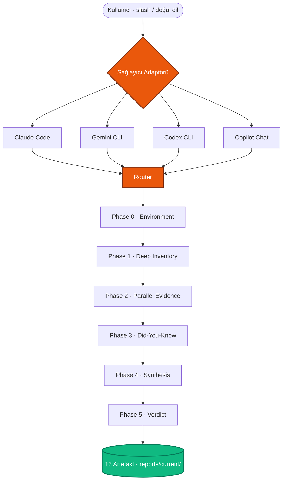

<div align="center">

# Ulak OS

### AI kodlama CLI'ları için sağlayıcıdan bağımsız prompt işletim sistemi

_Projeni okur · eksikleri söyler · tam yığın SaaS üretir_

<br>

[](https://github.com/osrt91/ulak-os/releases)
[](./LICENSE)
[](https://github.com/osrt91/ulak-os/stargazers)

[](./docs/adapters/claude-code.md)
[](./docs/adapters/gemini-cli.md)
[](./docs/adapters/codex-cli.md)
[](./docs/adapters/copilot-chat.md)

**🇹🇷 Türkçe** (bu dosya) · [**🇬🇧 English**](./README.en.md) · [**📚 Docs**](./docs/) · [**🗺️ Catalog**](./docs/catalog.md) · [**📝 Changelog**](./CHANGELOG.md)

</div>

---

<div align="center">

### ⚡ 30 saniyede başla

<table>
<tr>
<td width="33%" align="center" valign="top">

### 👋<br>Yeni kullanıcı
<br>

```
/ulak-hello
```

30 saniyelik tur<br>4 seçenek, doğrudan yönlendirme

</td>
<td width="33%" align="center" valign="top">

### 🔍<br>Var olan proje
<br>

```
/director komple
```

Phase 0→5 denetim<br>27 uzman paralel

</td>
<td width="33%" align="center" valign="top">

### 🛠️<br>Yeni SaaS
<br>

```
/ulak-start
```

27 soruluk sihirbaz<br>İlk commit'te üretime hazır

</td>
</tr>
</table>

</div>

---

## 📦 Kurulum

```bash
# macOS / Linux (tek satır)
curl -fsSL https://raw.githubusercontent.com/osrt91/ulak-os/main/scripts/install.sh | sh

# Windows PowerShell
iwr -useb https://raw.githubusercontent.com/osrt91/ulak-os/main/scripts/install.ps1 | iex

# Manuel klon
git clone https://github.com/osrt91/ulak-os.git && cd ulak-os
```

Sonra: Claude Code / Gemini CLI / Codex / Copilot aç, `/ulak-hello` yaz. Gerisi menüden.

> **Sağlama + alternatif yollar** → [docs/runbooks/install-methods.md](./docs/runbooks/install-methods.md) · **Doğrulama** → `ulak doctor`

---

## 🧭 Mimari



**İçe aktarım zinciri**: `CLAUDE.md` → `@prompts/core/ulak-os-core-contract-2.0.0.md` → **26 çalışma zamanı kuralı + 19 yönetişim + 4 sağlayıcı adaptörü**. Tek dosyadan tüm katmanlar yüklenir.

---

## 🎯 6 senaryo — ne yapabilirim?

<table>
<tr>
<td width="50%" valign="top">

**1. Yeni SaaS başlat** · `5-10 dk`
```bash
/ulak-start
```
27 soru, otomatik dağıtım → kardeş dizinde Next.js + Supabase + ödeme + i18n + CI + dağıtım. İlk commit'te RLS, kimlik doğrulama, webhook, gitleaks temeli hazır.

</td>
<td width="50%" valign="top">

**2. Mevcut projeyi denetle** · `45-90 dk`
```bash
/director komple
```
Phase 0→5: derin envanter (dosya+satır) · 4-13 uzman paralel · did-you-know · yol haritası · doğrulama planı · paket eksiği.

</td>
</tr>
<tr>
<td width="50%" valign="top">

**3. Doğal dille sor**
```bash
/ulak-ask "türkçe dil desteği ekle"
/ulak-ask "rls asimetrisi var mı"
/ulak-ask "paket eksiği tara"
```
Eklenti aramadan, bayrak ezberlemeden. Belirsizse "bunu mu dedin?" diye doğrular.

</td>
<td width="50%" valign="top">

**4. Paket + kapasite ara**
```bash
/ulak-packs
/pack-gap-audit
/ulak-mcp-discover
```
Tüm 24 komut + 10 beceri + 27 ajan tek ekranda. Eksik tespiti + MCP kayıt defteri keşfi.

</td>
</tr>
<tr>
<td width="50%" valign="top">

**5. Tanışma turu**
```bash
selam ulak       # TR doğal selamlama
hi ulak          # EN doğal selamlama
/ulak-hello      # slash
```
30 saniyede ilk ekran, 4 seçenek, doğrudan yönlendirme.

</td>
<td width="50%" valign="top">

**6. Güncelle + doğrula**
```bash
git pull origin main
ulak doctor
bash scripts/validate-*.sh
```
Platform bağımsız doğrulayıcı zinciri. Hepsi yeşilse paket sağlıklı.

</td>
</tr>
</table>

> **Uçtan uca rehber**: [docs/walkthrough/01-first-saas-end-to-end.md](./docs/walkthrough/01-first-saas-end-to-end.md) — 75 dakikalık pazaryeri senaryosu (Supabase + GitHub + Vercel + Resend + Iyzico)

---

## 📊 Kapasite özeti

<div align="center">

| **24** | **10** | **27** | **14** | **8** | **24** | **36** | **~100** |
|:---:|:---:|:---:|:---:|:---:|:---:|:---:|:---:|
| Komut | Beceri | Ajan | Sektör paketi | Kural paketi | Yönetişim | Çalışma zamanı kuralı | Anti-desen |

</div>

<details>
<summary><b>📂 Detaylı kırılım tablosu</b></summary>

<br>

| Yüzey | Sayı | Referans |
|---|---|---|
| **Komutlar** | 24 | [`.claude/commands/`](./.claude/commands/) — `/director`, `/ulak-start`, `/ulak-hello`, `/ulak-scaffold`, `/ulak-ask`, `/final-verdict`, `/intake`, `/frontend-war-room`, `/pack-gap-audit`, `/triage-build`, `/ulak-design-ref`, `/ulak-audit-deep`, `/ulak-pattern-extract`, `/ulak-mcp-discover`, `/ulak-brainstorm`, `/ulak-subagent-dispatch`, `/ulak-test-driven`, `/ulak-packs`, `/ulak-search`, `/ulak-locale`, `/ulak-intake`, `/ulak-demo`, `/ulak-explain`, `/ulak-next-steps` |
| **Beceriler** | 10 | [`.claude/skills/`](./.claude/skills/) — `saas-scaffolder`, `fourteen-dimension-audit`, `god-module-decomposition`, `multi-agent-orchestration`, `final-validation`, `pack-gap-completion`, `project-intake`, `research-currency`, `awesome-packs-index`, `mcp-governance-auto` |
| **Ajanlar** | 27 | [`.claude/agents/`](./.claude/agents/) — 19 uzman + 1 otonom program yönetici + 7 persona (admin, müşteri, bayi, geliştirici, destek, uyum, güvenlik-redteam) |
| **Sektör paketleri** | 14 | [`templates/sectors/`](./templates/sectors/) — education, saas, fintech, ecommerce, marketplace, enterprise-b2b, media-content, health-sensitive, ai-copilot, pwa-desktop, ai-relay-cost-control, member-gated-community, admin-cms-hardening, self-hosted-supabase |
| **Kural paketleri** | 8 | [`docs/runtime/rule-packs/`](./docs/runtime/rule-packs/) — typescript-nextjs, python-fastapi, docker-compose, api-security, turkish-locale, localization-ssot, llm-streaming-context-aware, react-native-expo |
| **Yönetişim** | 24 | [`docs/governance/`](./docs/governance/) — product-surface-split, rule-pack-governance, secrets-rotation-policy, observability-baseline, pattern-import-ledger, settings-permissions-governance, lock-file-hygiene, ai-provider-allowlist, mcp-governance, memory-hygiene, prompt-supply-chain, artefact-write-authorization vb. |
| **Çalışma zamanı** | 36 | [`docs/runtime/`](./docs/runtime/) — router, intent-router, program-phases (Phase 0-5), artefact-contract, context-budget, output-profiles, active-variable-contract, waves-pattern, live-probe-contract, dual-path-validation, persona-dispatch-pattern, runtime-constants vb. |
| **Anti-desen** | ~100 | 19 AP-NN (AP-01..AP-19) + klasik (IDOR, BOLA, N+1, RLS asimetrisi, ölü kod vb.) |
| **İskelet** | 285 | [`templates/saas-starter/`](./templates/saas-starter/) — Next.js 16 + TS strict + Tailwind v4 + Supabase SSR + RLS + CI + testler + VPS sıkılaştırma + 59 markalı tasarım referansı |

</details>

---

## 🎛️ Üç şey yapar

| | Komut | Ne üretir |
|---|---|---|
| 🔍 **Denetler** | `/director komple` | Phase 0→5 protokolü: 27 uzman paralel, 15 boyutlu değerlendirme, ~100 anti-desen taraması, 13 artefakt |
| ⚙️ **Yönetir** | `@prompts/core/ulak-os-core-contract-2.0.0.md` | Çekirdek sözleşme CLAUDE.md'ye içe aktarılır → 24 yönetişim + 14 sektör + 8 kural paketi her oturumda aktif |
| 🏗️ **İskelet kurar** | `/ulak-scaffold` veya `/ulak-start` | Tam yığın SaaS ilk commit'te — 285 şablon dosya + 8 anti-desen inşa anında kapıda tutulur |

---

## 🌐 Sağlayıcı desteği

<div align="center">

| Sağlayıcı | Komut dağıtımı | Durum | Adaptör |
|:---|:---:|:---:|:---:|
| **Claude Code** | 24 slash (yerel) | ✅ FULL | [↗](./docs/adapters/claude-code.md) |
| **Gemini CLI** | 24 `.toml` (yerel) | ✅ FULL-MINUS | [↗](./docs/adapters/gemini-cli.md) |
| **Codex CLI** | 24 doğal dil | ✅ CORE | [↗](./docs/adapters/codex-cli.md) |
| **Copilot Chat** | 22 doğal dil | ⚠️ LIMITED | [↗](./docs/adapters/copilot-chat.md) |

</div>

> Disk-gerçek parity doğrulaması: `bash scripts/validate-vendor-parity.sh`  
> Kapasite matrisi: [`docs/governance/vendor-capability-matrix.md`](./docs/governance/vendor-capability-matrix.md)

---

## 🛠️ Desteklenen yığın (`/ulak-scaffold`)

| Katman | Birincil | Deneysel |
|---|---|---|
| Önyüz | Next.js 16 | Remix, SvelteKit |
| Arkayüz | Supabase SSR | FastAPI + Node hibrit |
| Ödeme | Stripe · Iyzico · ikisi · yok | — |
| Mobil | Expo 55+ (opsiyonel) | — |
| Barındırma | Self-managed VPS + Traefik | Vercel · Fly.io · Railway |
| i18n | TR + EN taban | localization-ssot paketi ile ≥2 dil |

---

## 📜 Sürüm geçmişi

<table>
<tr><td><b>🚀 v1.6.0-final</b></td><td>2026-04-21</td><td>Sağlayıcılar arası parity — Gemini 7→24 yerel · Codex doğal dil · Copilot doğal dil · kapasite matrisi · kullanıcı kılavuzu tazeleme</td></tr>
<tr><td><b>🚶 v1.5.0</b></td><td>2026-04-21</td><td>Uçtan uca rehber #1 (75dk pazaryeri) · "selam ulak" / "hi ulak" doğal selamlama</td></tr>
<tr><td><b>🧑‍🏫 v1.4.0</b></td><td>2026-04-21</td><td>Dış servis eğitimleri — Supabase · Vercel · GitHub · Resend adım adım TR</td></tr>
<tr><td><b>🎓 v1.3.0</b></td><td>2026-04-21</td><td>Başlangıç katmanı — görünürlük · iskelet sonrası onboarding · çift modlu sihirbaz · terim açıklayıcı · demo turu</td></tr>
<tr><td><b>🧙 v1.2.0</b></td><td>2026-04-21</td><td>Sihirbaz derinleştirme — 6 → 27 soru × 5 faz · otomatik dağıtım · katalog eşitleme · 15 komut EN açıklaması</td></tr>
<tr><td><b>👁️ v1.1.0</b></td><td>2026-04-21</td><td>Görünürlük katmanı — ulak-ask · ulak-packs · ulak-search · ulak-start · ulak-hello · ulak-locale</td></tr>
<tr><td><b>🎉 v1.0.0</b></td><td>2026-04-21</td><td>Halka açık yayın — manifest sıfırlama · sürüm notları · CLI takma adı · doküman cilası</td></tr>
</table>

Tam notlar: [CHANGELOG.md](./CHANGELOG.md) · [docs/release/](./docs/release/)

---

## 📚 Daha fazla okuma

<table>
<tr>
<td width="50%" valign="top">

**🎬 Başlangıç**
- [30 saniyelik tur](./docs/ulak-hello-walkthrough.md) — `/ulak-hello` ilk ekran
- [İlk saat](./docs/runbooks/first-hour-with-ulak-os.md) — 60 dk uçtan uca
- [SSS](./docs/FAQ.md) — alternatiflerle karşılaştırma · platform · çevrimdışı · model
- [Sorun giderme](./docs/runbooks/troubleshooting.md) — 16 yaygın hata

</td>
<td width="50%" valign="top">

**🧰 Referans**
- [Katalog](./docs/catalog.md) — tüm kapasiteler tek yerde
- [Mimari](./docs/architecture/) — 4 mermaid diyagramı + açıklama
- [ADR](./docs/adr/) — 6 yönetişim kararı
- [Vitrin](./docs/showcase/) — 4 uçtan uca rehber + video senaryosu

</td>
</tr>
</table>

---

## 🤝 Katkıda bulun

**Mail atmana gerek yok — fork'la, çalıştır, PR aç.** Ulak OS topluluk katkısıyla büyüyor.

### ⚡ 3 dakikada ilk katkı

```bash
gh repo fork osrt91/ulak-os --clone              # 1) fork + klonla
cd ulak-os && bash scripts/validate-imports.sh   # 2) paket sağlığına bak
#    (bir sektör paketi ekle / yazım hatası düzelt / anti-desen yakala)
gh pr create                                     # 3) PR aç, şablon seni yönlendirir
```

### 🎯 Nereden başlayabilirim?

| İstiyorum | Git |
|---|---|
| Küçük bir iş arıyorum | [`good first issue`](https://github.com/osrt91/ulak-os/issues?q=is%3Aissue+is%3Aopen+label%3A%22good+first+issue%22) etiketli açık konular |
| Yeni sektör paketi / anti-desen / kural paketi | [pattern_contribution şablonu](https://github.com/osrt91/ulak-os/issues/new?template=pattern_contribution.md) |
| Hata raporlamak | [bug_report şablonu](https://github.com/osrt91/ulak-os/issues/new?template=bug_report.md) |
| Yeni komut / beceri / ajan fikri | [feature_request şablonu](https://github.com/osrt91/ulak-os/issues/new?template=feature_request.md) |
| Sormak istiyorum, issue açmak istemiyorum | [Discussions](https://github.com/osrt91/ulak-os/discussions) → Soru & Cevap |
| Derin rehber | [CONTRIBUTING.md](./CONTRIBUTING.md) — paket yönetişimi, kanıt kuralları, PR kontrol listesi |

### 📞 İletişim

- **Genel soru / öneri / fikir** → [GitHub Discussions](https://github.com/osrt91/ulak-os/discussions) (mail'den hızlı cevap)
- **Hata raporu** → [Issues](https://github.com/osrt91/ulak-os/issues/new/choose)
- **🔒 Güvenlik açığı** → issue AÇMAYIN, doğrudan mail: `info@oguzhansert.dev` ([SECURITY.md](./SECURITY.md))
- [Davranış Kuralları](./CODE_OF_CONDUCT.md) — topluluk standardı

---

<div align="center">

**📄 Lisans** — [MIT](./LICENSE) · fork'la, uyarla, kendi operasyonuna uygula. Atıf yeterli.

**👤 Sorumlu** — [**Oğuzhan Sert**](https://github.com/osrt91) · `info@oguzhansert.dev`

<br>

<sub>Ulak OS <b>v1.6.1</b> itibarıyla yetkili · Derleme bilgisi: <a href="./prompts/pack.json"><code>prompts/pack.json</code></a> · Çekirdek sözleşme: <a href="./prompts/core/ulak-os-core-contract-2.0.0.md"><code>ulak-os-core-contract-2.0.0.md</code></a></sub>

</div>
