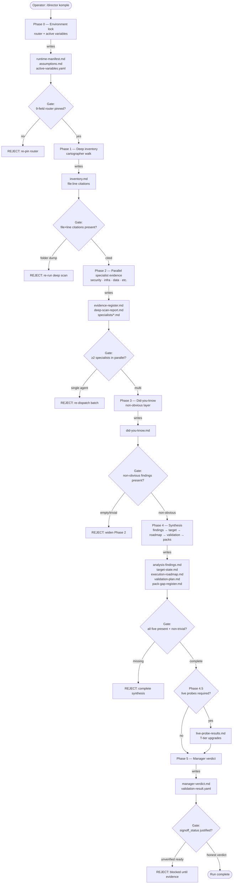

# Director Protocol — Phase 0 → Phase 5

The `/director komple` command dispatches the `autonomous-program-director` subagent, which runs a strict six-phase program. Every phase writes a mandated artefact under `reports/current/`; every phase has a **gate** that rejects shallow or single-source output. A manager verdict cannot claim completion if any gate is unsatisfied.

The canonical phase-to-artefact mapping is maintained in [`docs/adapters/claude-code.md`](../adapters/claude-code.md). This page mirrors that table with added detail on artefact contents and gate rejection criteria.

## Flow

## Phase detail

| Phase | Artefact contents | Gate REJECTS if |
|---|---|---|
| **0 — Environment lock** | `runtime-manifest.md`: git branch, last commit, uncommitted files, runtime versions, detected stacks, rule packs loaded, broken-lock sweep. `assumptions.md`: what the run treats as given and why. `active-variables.yaml`: the nine-field router decision (project_state, intervention_mode, output_profile, output_language, scope, live_probe_required, dispatch_mode, validation_depth, persona_set) pinned for the whole run. | Router decision YAML missing fields, or the run changes profile mid-flight. Unknown operator arguments logged but not recorded. Lock-file sweep skipped. |
| **1 — Deep inventory** | `inventory.md`: every application surface (public / customer / admin / partner), every API route, every config file, every env var, every migration, every i18n key per locale, every CI workflow, every Dockerfile, every reverse-proxy conf — listed as `path/to/file.ts:42-91` entries. Dependency graph plus unused-dep candidates. Dead code candidates. | "ls of top level" / folder dump without file paths. Missing line-range citations on non-trivial surfaces. Gitignored directories silently walked. Monorepo treated as single package. |
| **2 — Parallel specialist evidence** | `evidence-register.md`: raw per-specialist bullets keyed by specialist ID (`security-hardening-lead`, `infra-release-sre`, `data-database-governor`, `design-system-architect`, etc.). `deep-scan-report.md`: merged narrative ranked by severity. `specialists/<role>.md`: per-specialist deliverable with finding-schema YAML. | Single-generalist-agent evidence. Claims without `file:line` or URL citations. Claims without a T1-T7 trust tier. Specialists dispatched serially instead of in one parallel batch. Override-block missing from specialist briefs. |
| **3 — Did-you-know** | `did-you-know.md`: non-obvious findings — things the operator did not ask about and likely does not know. Targets: unused imports inflating bundle on specific routes, missing keys between locale files, RLS asymmetry across sibling tables, cert auto-renew without failure fallback, N+1 query risks, hardcoded strings bypassing i18n, admin endpoints without rate limit, deploy scripts without rollback, Dockerfile layers leaking secrets. | Empty file. Only restates findings the operator asked about in the initial prompt. Repeats Phase 2 evidence without extracting the non-obvious subset. Trivial items (typos) inflating the count. |
| **4 — Synthesis** | `analysis-findings.md`: evidence → findings with severity (Critical / High / Medium / Low / Cosmetic). `target-state.md`: desired future state per surface, per anti-pattern, per rule pack. `execution-roadmap.md`: ordered action list with `depends_on` groups for Waves. `validation-plan.md`: per-item verification method; §6 lists live probes when needed. `pack-gap-register.md`: missing commands/skills/agents/hooks/MCP/docs with severity. | One or more of the five files missing. Roadmap without `depends_on` groups (can't execute with Waves pattern). Validation-plan §6 empty when Critical findings rest on T2/T3 evidence. Pack-gap-register trivial when the run touched ≥3 unit types. |
| **4.5 — Live probe (conditional-mandatory)** | `live-probe-results.md`: probe id, target, command, result, T-tier upgrade (T2→T1 on confirmed, T2→contradicted on refuted), log reference. Run only if `validation-plan.md §6` has ≥1 probe, or any Critical finding depends on T2/T3 evidence, or the roadmap contains destructive remote actions. | Probes skipped when conditions trigger. Probes run with write/destructive semantics (belong to Phase 6 execution, not 4.5). Missing credentials silently ignored instead of pausing for operator. |
| **5 — Manager verdict** | `manager-verdict.md`: runtime decision, active agent map, per-phase artefact status (`complete` / `weak-evidence` / `missing`), critical vs. deferred vs. cosmetic split, top 3 did-you-know highlights inline, residual risks, next execution lane. `validation-result.yaml`: structured signoff per `docs/runtime/validation-result-schema.md`. | `signoff_status: ready` with unresolved Critical findings. Phase status marked `complete` while its artefact is missing or trivial. Phase 4.5 probes blocked-by-credentials but verdict still ready. Hidden-core content (version diffs) leaking into user-facing narrative. |

## Common failure modes

These are the gates that fail most often in real runs. If your director output looks suspicious, check these first.

**Folder-dump inventory (Phase 1).** The agent lists `src/`, `app/`, `lib/`, `infrastructure/` as three-line stubs without walking inside. Director rejects and re-dispatches with an explicit "cite file paths + line ranges" instruction. The `cartographer` agent file carries this constraint in its mandate; when it still fails, the issue is usually that the agent treated Phase 1 as a summary instead of a walk. Fix: `skip_phase_1=false` and re-run with the full intake protocol loaded.

**Single-agent evidence (Phase 2).** The director dispatches one generalist (often itself) and calls it evidence. The protocol requires a **parallel batch**: multiple `Task` calls in a single message, each to a distinct specialist. Rejection trigger is "evidence-register.md has fewer than two specialist sections." Fix: explicitly list applicable specialists in the dispatch prompt; don't let the director pick one.

**Empty or trivial did-you-know (Phase 3).** The agent produces `did-you-know.md` with items that restate what the operator already asked or that are cosmetic (typos, formatting). Non-obvious means **the operator doesn't know and didn't ask** — RLS asymmetry, missing locale keys, rate-limit gaps, deploy script missing rollback branch. Rejection trigger is "did-you-know.md is less than N non-obvious items" where N is inferred from project size. Fix: widen Phase 2 specialist coverage; a shallow Phase 2 produces a shallow Phase 3.

**Trivial validation-plan (Phase 4).** The agent writes `validation-plan.md` as a bulleted list of "check this works" without specifying method, command, expected output, or probe assignment. Section 6 (live probes) is empty even when Critical findings rest on T2 inferred-from-config evidence. Rejection trigger is "validation gate cannot pass because method is undefined." Fix: every Critical or High finding needs a **named validation method** — command + expected output, or live-probe reference, or manual-inspection-with-artefact.

**Unverified ready (Phase 5).** The verdict claims `signoff_status: ready` while residual risks include unresolved Critical findings. The validation-result schema forbids this; a Critical finding that didn't pass validation must either be downgraded (with evidence) or the signoff must be `conditional` / `blocked`. Fix: the verdict template in `docs/runtime/validation-result-schema.md` has the forbidden-combination check — use it literally.

## Related docs

- [`docs/adapters/claude-code.md`](../adapters/claude-code.md) — canonical phase table + schema references
- [`docs/runtime/router.md`](../runtime/router.md) — the 9-field router decision YAML
- [`docs/runtime/validation-result-schema.md`](../runtime/validation-result-schema.md) — Phase 5 signoff schema
- [`docs/runtime/live-probe-contract.md`](../runtime/live-probe-contract.md) — Phase 4.5 probe protocol
- [`docs/runtime/waves-pattern.md`](../runtime/waves-pattern.md) — Phase 6 execution grouping
- [`.claude/agents/autonomous-program-director.md`](../../.claude/agents/autonomous-program-director.md) — the executive manager subagent
