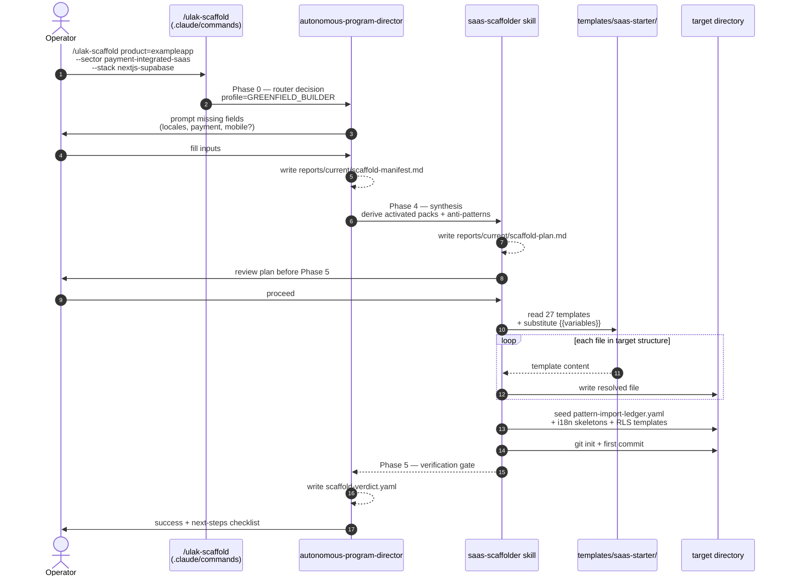

# Scaffolder Flow — `/ulak-scaffold`

The `/ulak-scaffold` command turns a short operator prompt into a shippable full-stack SaaS skeleton with Ulak OS governance applied **from commit 1**, not retrofitted later. The command dispatches the `saas-scaffolder` skill, which reads `templates/saas-starter/` and materializes a target directory.

Rationale and alternatives-considered live in [`docs/adr/ADR-005-saas-scaffolder.md`](../adr/ADR-005-saas-scaffolder.md). The skill contract lives in [`.claude/skills/saas-scaffolder/SKILL.md`](../../.claude/skills/saas-scaffolder/SKILL.md). This page shows the runtime sequence.

## Sequence



## The 27 templates

Grouped by concern. File paths are relative to `templates/saas-starter/`; each has a `.template` suffix that gets stripped on materialization. Variables use `{{product_name}}`, `{{locale_primary}}`, etc.

### Config (7)
- `tsconfig.json.template` — TS 5 strict, `noUncheckedIndexedAccess`, `exactOptionalPropertyTypes`
- `next.config.ts.template` — App Router, TypeScript config, image domains placeholder
- `tailwind.config.ts.template` — Tailwind v4 with content paths for app/ + components/
- `package.json.template` — pnpm, Next 16, TS 5, Supabase, Playwright, Vitest
- `middleware.ts.template` — Supabase SSR session rehydration + auth helper entry
- `.gitignore.template` — Ulak's full discipline block (`.env*`, `.claude/settings.local.json`, `reports/sessions/`)
- `.env.example.template` — all required env vars as placeholders, zero real secrets

### Auth (2)
- `lib/auth/index.ts.template` — single auth helper used by every surface (AP-11 prevention)
- `lib/supabase/{client,server,admin}.ts.template` — three role-scoped Supabase clients with server-only guards

### Database (2)
- `supabase/migrations/00001_initial_schema.sql.template` — tenants, users, audit_log, sessions tables
- `supabase/migrations/00002_rls_policies.sql.template` — tenant isolation templates, admin-bypass pattern, anonymous-deny default

### UI (3)
- `app/layout.tsx.template` — root layout with locale awareness + theme shell
- `app/globals.css.template` — Tailwind base + CSS variable tokens per design system
- `app/(public)/page.tsx.template` — landing page skeleton with i18n-aware strings

### Testing (3)
- `tests/unit/lib.test.ts.template` — one passing baseline unit test (vitest)
- `tests/e2e/landing.spec.ts.template` — smoke E2E: `/` loads (playwright)
- `.claude/settings.json.template` — operator guardrails with safe-default allow + deny lists

### CI (1)
- `.github/workflows/ci-validation.yml.template` — validate-imports + validate-schemas + gitleaks + typecheck + unit + e2e

### Deploy (2)
- `infrastructure/deploy.sh.template` — webhook-triggered deploy with health probe + rollback path (AP-12 prevention)
- `scripts/preflight.sh.template` — pre-push parity check (R-04) run before every push

### Hardening (2)
- `infrastructure/kale-kapisi.sh.template` — VPS hardening (UFW, fail2ban, SSH lockdown, docker-proxy) applied on first boot
- `scripts/install-hooks.sh.template` — installs `.githooks/pre-push` wiring preflight

### Docs (2)
- `CLAUDE.md.template` — imports Ulak OS core contract, activates scaffolder sector pack
- `DESIGN.md.template` — brand tokens + design reference link + typography baseline
- `README.md` — project README (not `.template`; stays as the starter intro)

Running `/ulak-scaffold` with the 27 templates produces a target directory of roughly 40 files (some templates materialize into multiple files via the skill's derived paths — e.g., `.env.example` generates both the example and the `.gitignore`-locked `.env.local` placeholder reminder).

## What you get on commit 1

Commit 1 of a scaffolded project has the following guarantees, each enforced by template or by the skill's derived-paths step:

- **RLS enabled on every tenant-scoped table.** `00002_rls_policies.sql` enables RLS on `tenants`, `users`, `audit_log`, `sessions`; policies template the `tenant_id = auth.jwt()->>'tenant_id'` predicate.
- **Audit log table seeded.** `audit_log` exists from migration 00001; the backend API template logs every mutation with actor + tenant + action + target.
- **Tenant isolation by construction.** The single `lib/auth/index.ts` helper resolves `tenant_id` from JWT; every server-role import uses it (AP-11 prevention).
- **CI gate in place.** `.github/workflows/ci-validation.yml` runs validate-imports, validate-schemas, gitleaks, typecheck, unit tests, and e2e smoke on every PR.
- **Preflight script wired.** `scripts/preflight.sh` + `install-hooks.sh` wire a pre-push check that mirrors CI; the operator can't push a broken build.
- **Webhook-triggered deploy with health probe.** `infrastructure/deploy.sh` signs the full webhook body + timestamp + nonce (AP-18 prevention), runs a health probe before marking deploy green (AP-12 prevention), and has a rollback path on failure.
- **VPS hardening ready.** `infrastructure/kale-kapisi.sh` applies fail2ban + UFW + SSH lockdown + docker-proxy on first `ssh user@vps` run.
- **`.env.local` never committable.** `.gitignore` blocks `.env*`; CI has a `gitleaks` scan that fails on any accidental commit.
- **i18n SSOT.** `docs/i18n/{tr,en}.json` seeded with baseline keys (login, logout, dashboard, settings); the rule pack `localization-ssot` rejects hardcoded user-facing strings on PR.
- **Pattern-import-ledger seeded.** `docs/governance/pattern-import-ledger.yaml` starts empty; future cross-project pattern imports track here (see ADR-004).
- **Product-surface-split enforced.** `app/(public)`, `app/(auth)`, `app/(customer)`, `app/(admin)` route groups separate prefixes; middleware gates admin + customer surfaces independently.
- **Governance imported from commit 1.** Generated `CLAUDE.md` `@-imports` the Ulak OS core contract; the next `/director komple` run on the new project starts with governance already loaded, not retrofitted.

## Post-scaffold sequence (operator runs)

```bash
cd ../exampleapp                     # the new directory
pnpm install                         # first install; generates pnpm-lock.yaml
cp .env.example .env.local           # fill with real values (never commit)
pnpm dev                             # verify baseline works
./scripts/install-hooks.sh           # enable pre-push parity
git log --oneline                    # confirm first commit is the scaffolder commit
```

Optionally run `/director komple` on the new project. The baseline audit should return zero Critical findings — governance was in from day 1, not retrofitted after two weeks.

## Related docs

- [`docs/adr/ADR-005-saas-scaffolder.md`](../adr/ADR-005-saas-scaffolder.md) — the decision record
- [`.claude/commands/ulak-scaffold.md`](../../.claude/commands/ulak-scaffold.md) — command spec with inputs + phases
- [`.claude/skills/saas-scaffolder/SKILL.md`](../../.claude/skills/saas-scaffolder/SKILL.md) — skill contract with target structure + rules
- [`docs/runtime/sector-packs.md`](../runtime/sector-packs.md) — SP-14 `greenfield-saas-starter`
- [`templates/saas-starter/README.md`](../../templates/saas-starter/README.md) — the starter's own README
